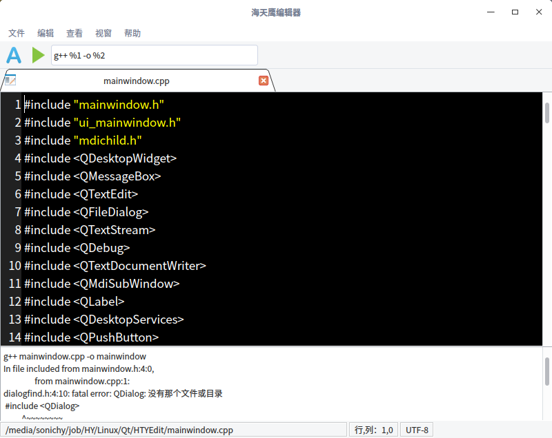

# Qt 海天鹰编辑器
基于 Qt 的文字编辑程序。  
已编译好的 HTYEdit 程序适用 64 位 Linux 系统 Qt5.11 环境，双击运行，其他版本请自行编译。  
install.sh 可以生成 desktop，并发送到系统开始菜单。
  
### 已知问题
从打开方式打开文件，文件只读无法保存。
### 参考：
多文档编辑器：http://www.qter.org/portal.php?mod=view&aid=10  
编译、运行输出：https://github.com/m-iDev-0792/HJ-Editor  
行号：http://doc.qt.io/qt-5/qtwidgets-widgets-codeeditor-example.html